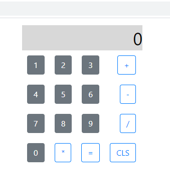

# ces26-tarefa5

Utilizando React e Redux implemente uma
calculadora com as quatro operações aritméticas
básicas.

### Executando em ambiente local

O presente projeto foi criado com o *create-react-app* de modo que já é automaticamente inicializada uma estrutura básica de aplicação em react.

Após obter uma cópia do diretório deve-se executar:
```bash
npm i
```
para que as dependências sejam satisfeitas.

Em seguida, basta inicializar a aplicação em ambiente local com:
```bash
npm start
```

Acessando o http://localhost:4008 a página inicial poderá ser visualizada com o browser.

### Estrutura geral
A página inicial da aplicação mostra uma calculadora simples com um visor para representação dos operandos e resultados.
Seguindo os requisitos indicados são tratadas as quatro operações aritméticas básicas, os operandos utilizados devem ser números inteiros mas os resultados retornados são valores racionais.

Conforme indicado pelo enunciado da tarefa foi utilizado o Redux. Desse modo foi possível observar o fluxo de trabalho com redux e utilizar um estado centralizado para a aplicação.

Além disso, foram definidos três componentes:

* digit.js: para os botões numéricos da calculadora
* oper.js: para os botões não numéricos da calculadora
* display.js: para a exibição do resultado da operação realizada

No arquivo *App.js* tem-se a utilização dos compoentes criados e montagem do layout da calculadora propriamente dita.



### Detalhes adicionais

Maiores informações sobre a atividade podem ser encontradas no relatório e no código comentado.
